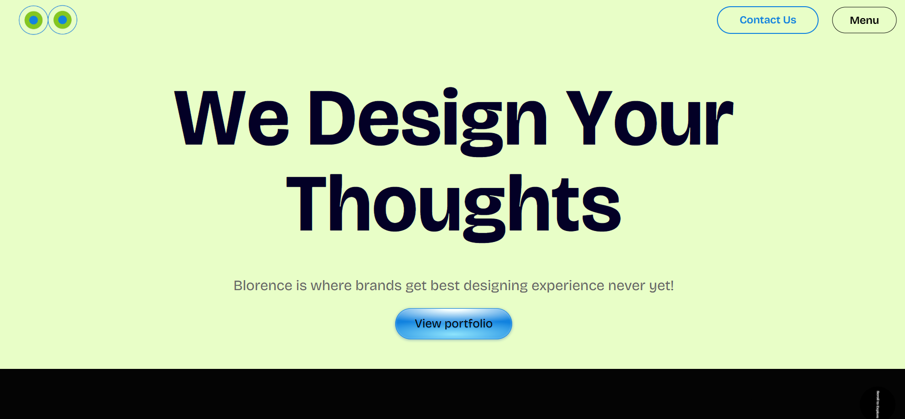
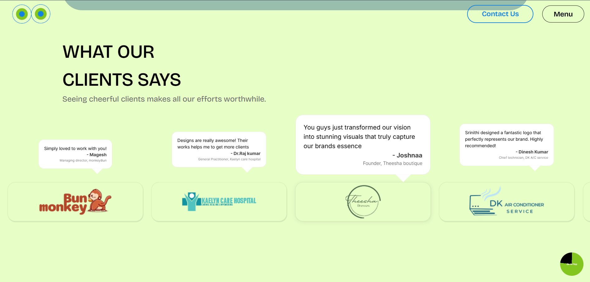
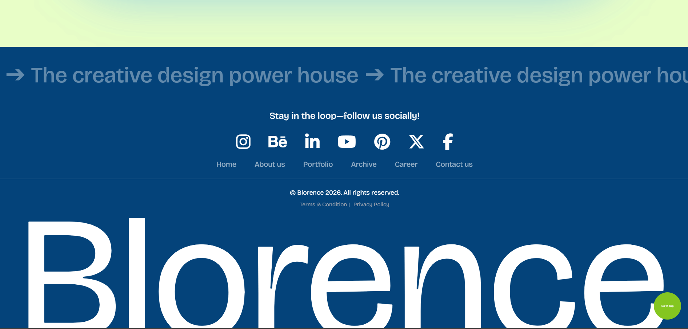

# Blorence Design Agency Website

A modern, responsive branding agency website built using **React.js**, **Tailwind CSS**, **GSAP**, **Framer Motion**, **Supabase**, and **EmailJS**.

The project showcases advanced frontend development skills including reusable React components, scroll-based animations, responsive UI, form validation, backend integration, SEO optimization, and production-ready deployment practices.

---

# Live Demo

https://blorencedesign.com/

---

# Screenshots

## Home Page





---

## Portfolio

(Add Screenshot)

---

## Contact Page

(Add Screenshot)

---

# Features

### Modern UI

- Clean responsive design
- Mobile-first approach
- Smooth scrolling experience
- Interactive portfolio sections

### Advanced Animations

- GSAP ScrollTrigger animations
- Framer Motion transitions
- Character-based text animations
- Image reveal animations
- Infinite scrolling effects

### Contact System

- Contact form validation
- EmailJS email notifications
- Supabase database integration
- Loading states
- Success & error handling

### Portfolio Showcase

- Individual project pages
- Case study layouts
- Responsive image galleries
- Brand information

### SEO

- React Helmet
- Dynamic page titles
- Meta descriptions
- Open Graph tags
- Semantic HTML

### Performance

- Lazy loaded assets
- Optimized animations
- Responsive images
- Reusable components

---

# Tech Stack

## Frontend

- React.js
- React Router DOM
- Tailwind CSS
- CSS3

## Animation

- GSAP
- ScrollTrigger
- Framer Motion

## Backend

- Supabase

## Form Services

- EmailJS

## SEO

- React Helmet Async

## Build Tool

- Vite

---

# Project Structure

```
src/

├── assets/
│   ├── Images
│   ├── Videos
│
├── Components/
│   ├── Hero
│   ├── About
│   ├── Portfolio
│   ├── Footer
│   ├── Contact
│   ├── Service
│   ├── Work
│
├── Pages/
│
├── lib/
│   └── supabase.js
│
├── App.jsx
│
└── main.jsx
```

---

# Contact Form Workflow

```
User
   │
   ▼
React Validation
   │
   ▼
Supabase Database
   │
   ▼
EmailJS Notification
   │
   ▼
Success Message
```

---

# Database

Supabase stores

- Name
- Email
- Phone Number
- Services Required
- Budget
- Brand Name
- Brand Description
- Brand Link
- Message
- Created Date

---

# Installation

Clone the repository

```bash
git clone https://github.com/mageshbalasundaram/blorence-agency-website.git
```

Go inside the project

```bash
cd blorence-agency-website
```

Install dependencies

```bash
npm install
```

Start development server

```bash
npm run dev
```

---

# Environment Variables

Create a `.env` file

```env
VITE_SUPABASE_URL=

VITE_SUPABASE_ANON_KEY=

VITE_EMAILJS_SERVICE_ID=

VITE_EMAILJS_TEMPLATE_ID=

VITE_EMAILJS_PUBLIC_KEY=
```

---

# Production Features

- Responsive Design
- Component Based Architecture
- Form Validation
- API Integration
- Database Integration
- Email Notifications
- SEO Optimized
- Environment Variables
- Error Handling
- Reusable Components

---

# Challenges Solved

### Complex GSAP Animations

Implemented reusable scroll-based animations while maintaining smooth performance across devices.

### Backend Integration

Integrated Supabase to store contact enquiries and EmailJS for instant email notifications.

### Responsive Layout

Designed and developed a fully responsive UI optimized for desktop, tablet, and mobile devices.

### Form Validation

Built client-side validation with loading states, success feedback, and error handling.

---

# Future Improvements

- Admin Dashboard
- Authentication
- CMS Integration
- Blog System
- Analytics Dashboard
- Multi-language Support

---

# Lighthouse Goals

- Performance 90+
- Accessibility 90+
- Best Practices 95+
- SEO 95+

---

# Author

**Magesh Balasundaram**

Frontend Developer

GitHub:
https://github.com/mageshbalasundaram/

LinkedIn:
https://www.linkedin.com/in/magesh-balasundaram/


---